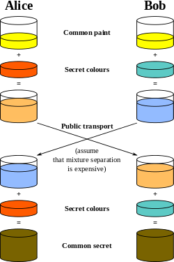

# 架构:算法 <small>Algorithm</small>

<ol class="breadcrumb"><li><a href="/">Home</a></li><li class="active">Algorithm</li></ol>

### 加密/解密

#### 对称加密
|名称|说明|
|------|------|
|DES|DES全称为Data Encryption Standard，即数据加密标准，是一种使用密钥加密的块算法，1977年被美国联邦政府的国家标准局确定为联邦资料处理标准（FIPS），并授权在非密级政府通信中使用，随后该算法在国际上广泛流传开来。需要注意的是，在某些文献中，作为算法的DES称为数据加密算法（Data Encryption Algorithm,DEA），已与作为标准的DES区分开来|
|3DES / TDEA|3DES（或称为Triple DES）是三重数据加密算法（TDEA，Triple Data Encryption Algorithm）块密码的通称。它相当于是对每个数据块应用三次DES加密算法。由于计算机运算能力的增强，原版DES密码的密钥长度变得容易被暴力破解；3DES即是设计用来提供一种相对简单的方法，即通过增加DES的密钥长度来避免类似的攻击，而不是设计一种全新的块密码算法|
|`AES`|高级加密标准（英语：Advanced Encryption Standard，缩写：AES），在密码学中又称Rijndael加密法，是美国联邦政府采用的一种区块加密标准。这个标准用来替代原先的DES，已经被多方分析且广为全世界所使用。经过五年的甄选流程，高级加密标准由美国国家标准与技术研究院（NIST）于2001年11月26日发布于FIPS PUB 197，并在2002年5月26日成为有效的标准。2006年，高级加密标准已然成为对称密钥加密中最流行的算法之一|
|BlowFish|Blowfish算法是一个64位分组及可变密钥长度的对称密钥分组密码算法，可用来加密64比特长度的字符串。32位处理器诞生后，Blowfish算法因其在加密速度上超越了DES而引起人们的关注。Blowfish算法具有加密速度快、紧凑、密钥长度可变、可免费使用等特点，已被广泛使用于众多加密软件|
|IDEA|IDEA是International Data Encryption Algorithm 的缩写,是1990年由瑞士联邦技术学院来学嘉X.J.Lai 和Massey提出的建议标准算法称作PES( Proposed Encryption Standard) 。Lai 和Massey 在1992 年进行了改进强化了抗差分分析的能力改称为IDEA 它也是对64bit大小的数据块加密的分组加密算法密钥长度为128位它基于"相异代数群上的混合运算"设计思想算法用硬件和软件实现都很容易且比DES在实现上快的多。IDEA自问世以来，已经经历了大量的详细审查，对密码分析具有很强的抵抗能力，在多种商业产品中被使用|
|MARs|1997 年IBM公司为参选NIST（美国标准局，National Institute of Standards and Technology，MARs于1998年8月20号进入NIST第一组15个AES 候选名单，并于1999 年4 月15 日进入第二阶段候选名单，第二阶段共有5个最终候选算法，分别是 MARs , Rc6，Ri jndael, Serpent和Twofish，最后胜出的是Ri jndael。MARS算法支持128~448位变长密钥,定义一个临时容器ULONG32 T[15]用于存放用户输入的密钥|
|Rabbit|Rabbit流密码是由Cryptico公司设计的，密钥长度128位，最大加密消息长度为264 Bytes，即16 TB，若消息超过该长度，则需要更换密钥对剩下的消息进行处理。它是目前安全性较高，加/解密速度比较高效的流密码之一，在各种处理器平台上都有不凡的表现|
|RC2|RC2是由著名密码学家Ron Rivest设计的一种传统对称分组加密算法，它可作为DES算法的建议替代算法。它的输入和输出都是64比特。密钥的长度是从1字节到128字节可变，但目前的实现是8字节|
|RC4|RC4加密算法是大名鼎鼎的RSA三人组中的头号人物Ronald Rivest在1987年设计的密钥长度可变的流加密算法簇。之所以称其为簇，是由于其核心部分的S-box长度可为任意，但一般为256字节。该算法的速度可以达到DES加密的10倍左右，且具有很高级别的非线性。RC4起初是用于保护商业机密的。但是在1994年9月，它的算法被发布在互联网上，也就不再有什么商业机密了。RC4也被叫做ARC4（Alleged RC4——所谓的RC4），因为RSA从来就没有正式发布过这个算法|
|RC5|RC5分组密码算法是1994由麻萨诸塞技术研究所的Ronald L. Rivest教授发明的，并由RSA实验室分析。它是参数可变的分组密码算法，三个可变的参数是：分组大小、密钥大小和加密轮数。在此算法中使用了三种运算：异或、加和循环|
|TEA|TEA算法使用64位的明文分组和128位的密钥，它使用Feistel分组加密框架，需要进行 64 轮迭代，尽管作者认为 32 轮已经足够了。该算法使用了一个神秘常数δ作为倍数，它来源于黄金比率，以保证每一轮加密都不相同。但δ的精确值似乎并不重要，这里 TEA 把它定义为 δ=「(√5 - 1)231」（也就是程序中的 0×9E3779B9）。之后 TEA 算法被发现存在缺陷，作为回应，设计者提出了一个 TEA 的升级版本——XTEA（有时也被称为“tean”）|
|SKIPJACK|Skipjack是美国政府在Clipper芯片和FortezzaPC卡中使用的密钥加密算法。是一个密钥长度为80比特、明文和密文长度均为64比特、轮数为32的分组密码。它在防篡改硬件中实现,1998年Skipjack算法被公开。从目前的各种分析表明,该算法是安全|

#### 非对称加密
|名称|说明|
|------|------|
|ECC|椭圆加密算法（ECC）是一种公钥加密体制，最初由Koblitz和Miller两人于1985年提出，其数学基础是利用椭圆曲线上的有理点构成Abel加法群上椭圆离散对数的计算困难性|
|Elgamal|ElGamal加密算法是一种非对称加密算法，基于Diffie-Hellman密钥交换算法，由Taher Elgamal在1985年提出。ElGamal加密算法可以应用在任意一个循环群(cyclic group)上。在群中有的运算求解很困难，这些运算通常与求解离散对数(Discrete logarithm)相关，求解的困难程度决定了算法的安全性|
|Rabin|Rabin算法是一种基于模平方和模平方根的非对称加密算法。当然，Rabin算法具有其致命的缺陷：一个密文对应四个明文。但此算法仍然包含了密码学中的基本概念和技巧，如单向函数、整数的因数分解等|
|`RSA`|RSA公钥加密算法是1977年由罗纳德·李维斯特（Ron Rivest）、阿迪·萨莫尔（Adi Shamir）和伦纳德·阿德曼（Leonard Adleman）一起提出的。1987年首次公布，当时他们三人都在麻省理工学院工作。RSA就是他们三人姓氏开头字母拼在一起组成的。RSA是目前最有影响力的公钥加密算法，它能够抵抗到目前为止已知的绝大多数密码攻击，已被ISO推荐为公钥数据加密标准|

### 签名/校验
|名称|说明|
|------|------|
|ECDSA|椭圆曲线数字签名算法（ECDSA）是使用椭圆曲线密码（ECC）对数字签名算法（DSA）的模拟。ECDSA于1999年成为ANSI标准，并于2000年成为IEEE和NIST标准。它在1998年既已为ISO所接受，并且包含它的其他一些标准亦在ISO的考虑之中。与普通的离散对数问题（discrete logarithm problem  DLP）和大数分解问题（integer factorization problem  IFP）不同，椭圆曲线离散对数问题（elliptic curve discrete logarithm problem  ECDLP）没有亚指数时间的解决方法。因此椭圆曲线密码的单位比特强度要高于其他公钥体制|
|MD4|MD4是麻省理工学院教授Ronald Rivest于1990年设计的一种信息摘要算法。它是一种用来测试信息完整性的密码散列函数的实行。其摘要长度为128位，一般128位长的MD4散列被表示为32位的十六进制数字。这个算法影响了后来的算法如MD5、SHA 家族和RIPEMD等|
|`MD5`|MD5即Message-Digest Algorithm 5（信息-摘要算法5），用于确保信息传输完整一致。是计算机广泛使用的杂凑算法之一（又译摘要算法、哈希算法），主流编程语言普遍已有MD5实现。将数据（如汉字）运算为另一固定长度值，是杂凑算法的基础原理，MD5的前身有MD2、MD3和MD4|
|RIPEMD-128 RIPEMD-160 RIPEMD-256 RIPEMD-320|RIPEMD（RACE Integrity Primitives Evaluation Message Digest，RACE原始完整性校验消息摘要），是Hans Dobbertin等3人在md4,md5的基础上，于1996年提出来的。算法共有4个标准128、160、256和320，其对应输出长度分别为16字节、20字节、32字节和40字节。不过，让人难以致信的是RIPEMD的设计者们根本就没有真正设计256和320位这2种标准，他们只是在128位和160位的基础上，修改了初始参数和s-box来达到输出为256和320位的目的。所以，256位的强度和128相当，而320位的强度和160位相当。RIPEMD建立在md的基础之上，所以，其添加数据的方式和md5完全一样|
|SHA1|安全哈希算法（Secure Hash Algorithm）主要适用于数字签名标准 （Digital Signature Standard DSS）里面定义的数字签名算法（Digital Signature Algorithm DSA）。对于长度小于2^64位的消息，SHA1会产生一个160位的消息摘要。当接收到消息的时候，这个消息摘要可以用来验证数据的完整性。在传输的过程中，数据很可能会发生变化，那么这时候就会产生不同的消息摘要。 SHA1有如下特性：不可以从消息摘要中复原信息；两个不同的消息不会产生同样的消息摘要,(但会有1x10 ^ 48分之一的机率出现相同的消息摘要,一般使用时忽略)|
|`SHA3`|由于近年来对传统常用Hash 函数如MD4、MD5、SHA0、SHA1、RIPENMD 等的成功攻击，美国国家标准技术研究所（NIST）在2005年、2006年分别举行了2届密码Hash 研讨会；同时于2007年正式宣布在全球范围内征集新的下一代密码Hash算法，举行SHA-3竞赛·新的Hash算法将被称为SHA-3，并且作为新的安全Hash标准，增强现有的FIPS 180-2标准。算法提交已于2008年10月结束，NIST 将分别于2009年和2010年举行2轮会议，通过2轮的筛选选出进入最终轮（final round）的算法，最后将在2012年公布获胜算法。公开竞赛的整个进程仿照高级加密标准AES 的征集过程。2012年10月2日，Keccak被选为NIST竞赛的胜利者， 成为SHA-3|
|Tiger|TIGER由Ross在1995年提出。Tiger号称是最快的Hash算法，专门为64位机器做了优化|
|`Adler-32`|校验算法Adler-32是Mark Adler发明的校验和算法，和32位CRC校验算法一样，都是保护数据防止意外更改的算法，但是这个算法较容易被伪造，所以是不安全的保护措施。但是比CRC好点的是，它计算的很快。这个算法那是从Fletcher校验和算法中修改过来的，原始的算法形式略快，但是可依赖性并不高。Adler-32的一种滚动哈希版本被用在了`rsync`工具中|
|`CRC32`|CRC校验实用程序库 在数据存储和数据通讯领域，为了保证数据的正确，就不得不采用检错的手段。在诸多检错手段中，CRC是最著名的一种。CRC的全称是循环冗余校验|
|`HMACMD5`|HMACMD5 是从 MD5 哈希函数构造的一种键控哈希算法，被用作基于哈希的消息验证代码 (HMAC)。此 HMAC 进程将密钥与消息数据混合，使用哈希函数对混合结果进行哈希计算，将所得哈希值与该密钥混合，然后再次应用哈希函数。输出的哈希值长度为 128 位|

### 编码/解码
|名称|说明|
|------|------|
|`Base64`|Base64是网络上最常见的用于传输8Bit字节代码的编码方式之一，大家可以查看RFC2045～RFC2049，上面有MIME的详细规范。Base64编码可用于在HTTP环境下传递较长的标识信息。例如，在Java Persistence系统Hibernate中，就采用了Base64来将一个较长的唯一标识符（一般为128-bit的UUID）编码为一个字符串，用作HTTP表单和HTTP GET URL中的参数。在其他应用程序中，也常常需要把二进制数据编码为适合放在URL（包括隐藏表单域）中的形式。此时，采用Base64编码具有不可读性，即所编码的数据不会被人用肉眼所直接看到|
|URL编码|url编码是一种浏览器用来打包表单输入的格式。浏览器从表单中获取所有的name和其中的值 ，将它们以name/value参数编码（移去那些不能传送的字符，将数据排行等等）作为URL的一部分或者分离地发给服务|

### 压缩/解压
|名称|说明|
|------|------|
|`deflate`|DEFLATE是同时使用了LZ77算法与哈夫曼编码（Huffman Coding）的一个无损数据压缩算法。人们普遍认为DEFLATE不受任何专利所制约，并且在LZW（GIF文件格式使用）相关的专利失效之前，这种格式除了在ZIP文件格式中得到应用之外也在gzip压缩文件以及PNG图像文件中得到了应用。更高压缩率的DEFLATE是7-zip所实现的。AdvanceCOMP也使用这种实现，它可以对gzip、PNG、MNG以及ZIP文件进行压缩从而得到比zlib更小的文件大小|
|`gzip`|gzip是GNUzip的缩写，它是一个GNU自由软件的文件压缩程序。它是Jean-loupGailly和MarkAdler一起开发的。第一次公开发布版本是1992年10月31日发布的版本0.1，1993年2月发布了版本1.0。HTTP协议上的GZIP编码是一种用来改进WEB应用程序性能的技术。大流量的WEB站点常常使用GZIP压缩技术来让用户感受更快的速度。这一般是指WWW服务器中安装的一个功能，当有人来访问这个服务器中的网站时，服务器中的这个功能就将网页内容压缩后传输到来访的电脑浏览器中显示出来.一般对纯文本内容可压缩到原大小的40%.这样传输就快了，效果就是你点击网址后会很快的显示出来.当然这也会增加服务器的负载. 一般服务器中都安装有这个功能模块的|

### 算法辅助
|名称|说明|
|------|------|
|Diffie-Hellman|Diffie-Hellman:一种确保共享KEY安全穿越不安全网络的方法，它是OAKLEY的一个组成部分。Whitefield与Martin Hellman在1976年提出了一个奇妙的密钥交换协议，称为Diffie-Hellman密钥交换协议/算法(Diffie-Hellman Key Exchange/Agreement Algorithm).这个机制的巧妙在于需要安全通信的双方可以用这个方法确定对称密钥。然后可以用这个密钥进行加密和解密。但是注意，这个密钥交换协议/算法只能用于密钥的交换，而不能进行消息的加密和解密。双方确定要用的密钥后，要使用其他对称密钥操作加密算法实际加密和解密消息 |
|PBE|PBE算法（Password Based Encryption，基于口令加密）是一种基于口令的加密算法，其特点是使用口令代替了密钥，而口令由用户自己掌管，采用随机数杂凑多重加密等方法保证数据的安全性。PBE算法在加密过程中并不是直接使用口令来加密，而是加密的密钥由口令生成，这个功能由PBE算法中的KDF函数完成。KDF函数的实现过程为：将用户输入的口令首先通过“盐”（salt）的扰乱产生准密钥，再将准密钥经过散列函数多次迭代后生成最终加密密钥，密钥生成后，PBE算法再选用对称加密算法对数据进行加密，可以选择DES、3DES、RC5等对称加密算法|
|Rijndael|（美国）国家标准技术研究所（NIST）选择Rijndael作为美国政府加密标准（AES）的加密算法，AES取代早期的数据加密标准（DES）。Rijndael由比利时计算机科学家Vincent Rijmen和Joan Daemen开发，它可以使用128位，192位或者256位的密钥长度，使得它比56位的DES更健壮可靠。Rijndael被设计用来支持更多的密钥长度，然而除了上述3种密钥长度，其他密钥长度并没有被AES采用。Rijndael也有一个非常小的版本（52位），合适用在蜂窝电话、个人数字处理器（PDA）和其他的小设备上|
|Serpent|Serpent 是 Ross Anderson, Eli Biham 和 Lars Knudsen 开发的块加密算法. Serpent 可以使用不同的密钥长度. Serpent 也是高级加密标准 (AES)的5个候选之一. BestCrypt 以LRW模式使用 Serpent 算法, 256位密钥, 128位块大小和 32 次循环|
|Twofish|Twofish是之前Blowfish算法的加密算法，它曾是NIST替换DES算法的高级加密标准（AES）算法的候选算法。（NIST最终选择了Rijndael算法）。同Blowfish一样，Twofish使用分组加密机制。Twofish使用任何长度为256比特的单个密钥，并声称对如智能卡的微处理器和嵌入在硬件中运行的软件很有效。它允许使用者调节加密速度，密钥安装时间，和编码大小来平衡性能|
|Whirlpool|Whirlpool算法被列入了ISO标准。主要原因是因为其强大的安全度。第一点，Whirlpool使用了和AES加密标准相同的转化技术，只不过，AES使用的模函数为：f(x) = x^8 + x^4 + x^3 + x + 1, 即0x11B；而Whirlpool使用的是：f(x) = x^8 + x^4 + x^3 + x^2 + 1, 即0x11D。第二点，Whirlpool的输出是512位的。为了加快计算速度，Whirlpool使用的所有表格都已经时间计算好了。Whirlpool在历史上共有3个版本，根据最新的2003年版本，我们把目前的Whirlpool算法叫做Whirlpool 3.0|
|CBC|1976年，IBM发明了密码分组链接（CBC，Cipher-block chaining）模式。在CBC模式中，每个明文块先与前一个密文块进行异或后，再进行加密。在这种方法中，每个密文块都依赖于它前面的所有明文块。同时，为了保证每条消息的唯一性，在第一个块中需要使用初始化向量|
|HMAC|HMAC是密钥相关的哈希运算消息认证码，HMAC运算利用哈希算法，以一个密钥和一个消息为输入，生成一个消息摘要作为输出|
