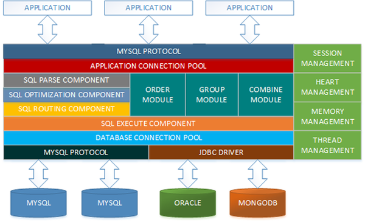

# 架构:负载均衡 <small>Load Balance</small>

<ol class="breadcrumb"><li><a href="/">Home</a></li><li class="active">Load Balance</li></ol>

### Http负载均衡
|名称|网址|说明|
|------|------|------|
|`Nginx`|http://nginx.org/|Nginx不仅是一个小巧且高效的HTTP服务器，也可以做一个高效的负载均衡反向代理，通过它接受用户的请求并分发到多个Mongrel进程可以极大提高Rails应用的并发能力|

### Tcp负载均衡
|名称|网址|说明|
|------|------|------|
|`LVS`|https://github.com/alibaba/LVS|LVS(LinuxVirtual Server)是由章文嵩博士主导开发的一款开源软件，可以实现Linux平台下的基于网络层的负载均衡软件 |
|Keepalived|https://github.com/acassen/keepalived|Keepalived的作用是检测服务器的状态，如果有一台web服务器死机，或工作出现故障，Keepalived将检测到，并将有故障的服务器从系统中剔除，当服务器工作正常后Keepalived自动将服务器加入到服务器群中，这些工作全部自动完成，不需要人工干涉，需要人工做的只是修复故障的服务器 |
|HAProxy|http://www.haproxy.com/|HAProxy提供高可用性、负载均衡以及基于TCP和HTTP应用的代理，支持虚拟主机，它是免费、快速并且可靠的一种解决方案。HAProxy特别适用于那些负载特大的web站点，这些站点通常又需要会话保持或七层处理。HAProxy运行在当前的硬件上，完全可以支持数以万计的并发连接。并且它的运行模式使得它可以很简单安全的整合进您当前的架构中， 同时可以保护你的web服务器不被暴露到网络上 |
|VIPServer| |VIPServer是阿里中间件团队开发的一个中间层负载均衡(mid-tier load balancing)产品，VIPServer是基于P2P模式，是一个七层负载均衡产品。VIPServer提供动态域名解析和负载均衡服务，支持很多诸如多业务单元同单元优先、同机房优先、同区域优先等一系列流量智能调度和容灾策略，支持多种健康监测协议，支持精细的权重控制，提供多级容灾体系、具有对称调用、健康阈值保护等保护功能的解决方案。是阿里负载均衡体系、域名服务体系的一个非常重要的组成部分 |

### 数据库集群
|名称|网址|说明|
|------|------|------|
|`MyCAT`|https://github.com/MyCATApache/Mycat-Server|MyCAT是一个开源的分布式数据库系统，是一个实现了MySQL协议的服务器，前端用户可以把它看作是一个数据库代理，用MySQL客户端工具和命令行访问，而其后端可以用MySQL原生协议与多个MySQL服务器通信，也可以用JDBC协议与大多数主流数据库服务器通信，其核心功能是分表分库，即将一个大表水平分割为N个小表，存储在后端MySQL服务器里或者其他数据库里。MyCat发展到目前的版本，已经不是一个单纯的MySQL代理了，它的后端可以支持MySQL、SQL Server、Oracle、DB2、PostgreSQL等主流数据库，也支持MongoDB这种新型NoSQL方式的存储，未来还会支持更多类型的存储。而在最终用户看来，无论是那种存储方式，在MyCat里，都是一个传统的数据库表，支持标准的SQL语句进行数据的操作，这样一来，对前端业务系统来说，可以大幅降低开发难度，提升开发速度 |
|Atlas|https://github.com/Qihoo360/Atlas|Atlas是由 Qihoo 360,  Web平台部基础架构团队开发维护的一个基于MySQL协议的数据中间层项目。它在MySQL官方推出的MySQL-Proxy 0.8.2版本的基础上，修改了大量bug，添加了很多功能特性。目前该项目在360公司内部得到了广泛应用，很多MySQL业务已经接入了Atlas平台，每天承载的读写请求数达几十亿条|
|MHA|https://github.com/yoshinorim/mha4mysql-manager|MHA（Master High Availability）目前在MySQL高可用方面是一个相对成熟的解决方案，它由日本DeNA公司youshimaton（现就职于Facebook公司）开发，是一套优秀的作为MySQL高可用性环境下故障切换和主从提升的高可用软件。在MySQL故障切换过程中，MHA能做到在0~30秒之内自动完成数据库的故障切换操作，并且在进行故障切换的过程中，MHA能在最大程度上保证数据的一致性，以达到真正意义上的高可用 |
|`Codis`|https://github.com/CodisLabs/codis|Codis 是一个分布式 Redis 解决方案, 对于上层的应用来说, 连接到 Codis Proxy 和连接原生的 Redis Server 没有明显的区别 (不支持的命令列表), 上层应用可以像使用单机的 Redis 一样使用, Codis 底层会处理请求的转发, 不停机的数据迁移等工作, 所有后边的一切事情, 对于前面的客户端来说是透明的, 可以简单的认为后边连接的是一个内存无限大的 Redis 服务 |

