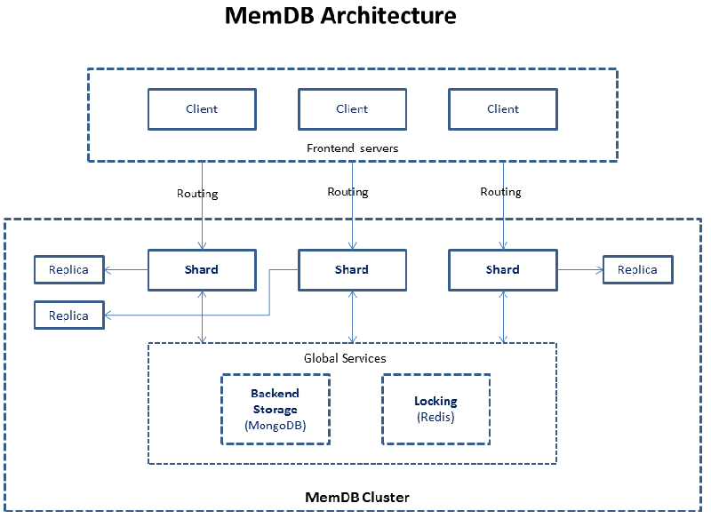

#  数据库 <small>Database</small>

<ol class="breadcrumb"><li><a href="/">Home</a></li><li class="active">Database</li></ol>

### 分类 <small>Category</small>

#### 关系型数据库
|名称|网址|说明|
|------|------|------|
|SQL Server|https://www.microsoft.com/en-us/sql-server/sql-server-vnext-including-Linux|今年三月份，微软首次宣布自旗舰产品SQL Server将支持Linux平台，给世界带来了一个巨大的惊喜。到目前为止，只有被邀请才能预览。但是微软11月17日在纽约举办的Connect开发者大会上宣布，想尝试的用户现在可以试用其内测预览版了。此内测预览版是第一个可同时用于Windows和Linux的版本。 由于新版SQL Server支持Docker容器，甚至MacOS用户也能够运行。事实上，微软正下赌注——将容器作为预览的主要分发机制之一——它很快就会从Azure Virtual Machines和Docker Hub得到。用户也可以为Red Hat、Ubuntu和SUSE等流行的发行版下载其RPM、APT等格式的软件包|
|`MySQL`|https://www.mysql.com/|MySQL是一个关系型数据库管理系统，由瑞典MySQL AB 公司开发，目前属于 Oracle 旗下产品。MySQL 是最流行的关系型数据库管理系统之一，在 WEB 应用方面，MySQL是最好的 RDBMS (Relational Database Management System，关系数据库管理系统) 应用软件|
|Oracle|https://www.oracle.com/|Oracle Database，又名Oracle RDBMS，或简称Oracle。是甲骨文公司的一款关系数据库管理系统。它是在数据库领域一直处于领先地位的产品。可以说Oracle数据库系统是目前世界上流行的关系数据库管理系统，系统可移植性好、使用方便、功能强，适用于各类大、中、小、微机环境。它是一种高效率、可靠性好的 适应高吞吐量的数据库解决方案|
|`AliSQL`|https://github.com/alibaba/AliSQL|AliSQL是阿里巴巴基于于MySQL官方版本的一个分支，应用于阿里巴巴集团业务以及阿里云数据库服务。目前由阿里云数据库团队维护。AliSQL版本在强度和广度上都经历了极大的考验。最新的AliSQL版本从其他开源分支比如：Percona，MariaDB，WebScaleSQL等社区得到帮助，也从阿里巴巴MySQL领域的经验和解决方案得到经验|
|Percona|https://www.percona.com/|Percona Server为 MySQL 数据库服务器进行了改进，在功能和性能上较 MySQL 有着很显著的提升。该版本提升了在高负载情况下的 InnoDB 的性能、为 DBA 提供一些非常有用的性能诊断工具；另外有更多的参数和命令来控制服务器行为|
|Oracle|https://www.oracle.com/|Oracle Database，又名Oracle RDBMS，或简称Oracle。是甲骨文公司的一款关系数据库管理系统。它是在数据库领域一直处于领先地位的产品。可以说Oracle数据库系统是目前世界上流行的关系数据库管理系统，系统可移植性好、使用方便、功能强，适用于各类大、中、小、微机环境。它是一种高效率、可靠性好的 适应高吞吐量的数据库解决方案|
|`PostgreSQL`|https://www.postgresql.org/|PostgresQL是以加州大学伯克利分校计算机系开发的 POSTGRES，现在已经更名为PostgreSQL，版本 4.2为基础的对象关系型数据库管理系统（ORDBMS）。PostgreSQL支持大部分 SQL标准并且提供了许多其他现代特性：复杂查询、外键、触发器、视图、事务完整性、MVCC。同样，PostgreSQL 可以用许多方法扩展，比如， 通过增加新的数据类型、函数、操作符、聚集函数、索引。免费使用、修改、和分发 PostgreSQL，不管是私用、商用、还是学术研究使用|
|`SQLite`|https://www.sqlite.org/|SQLite，是一款轻型的数据库，是遵守ACID的关系型数据库管理系统，它包含在一个相对小的C库中。它是D.RichardHipp建立的公有领域项目。它的设计目标是嵌入式的，而且目前已经在很多嵌入式产品中使用了它，它占用资源非常的低，在嵌入式设备中，可能只需要几百K的内存就够了。它能够支持Windows/Linux/Unix等等主流的操作系统，同时能够跟很多程序语言相结合，比如 Tcl、C#、PHP、Java等，还有ODBC接口，同样比起Mysql、PostgreSQL这两款开源的世界著名数据库管理系统来讲，它的处理速度比他们都快|
|Informix|http://www.ibm.com/analytics/us/en/technology/informix/|Informix是IBM公司出品的关系数据库管理系统（RDBMS）家族。作为一个集成解决方案，它被定位为作为IBM在线事务处理（OLTP）旗舰级数据服务系统。 IBM对Informix和DB2都有长远的规划，两个数据库产品互相吸取对方的技术优势|
|Realm|https://realm.io/|realm是一个跨平台移动数据库引擎,支持iOS、OS X(Objective-C和Swift)以及Android|
|Firebird|https://github.com/FirebirdSQL/firebird|Firebird特性介绍firebird是一个全功能的，强大高效的，轻量级，免维护的数据库。它很容易让您从单用户，单数据库升级到企业级的应用。 给中小型企业提供了一个很好的工具，一些需要小的数据库的软件|
|Berkeley DB|http://www.oracle.com/technetwork/database/database-technologies/berkeleydb/overview/index.html|Berkeley DB是一个开源的文件数据库，介于关系数据库与内存数据库之间，使用方式与内存数据库类似，它提供的是一系列直接访问数据库的函数，而不是像关系数据库那样需要网络通讯、SQL解析等步骤|

#### 键值存储数据库
|名称|网址|说明|
|------|------|------|
|BeansDB|https://github.com/douban/beansdb|BeansDB（豆瓣开源数据存储系统），豆瓣公司以New BSD许可证发布了分布式key/value存储系统BeansDB，开发者称BeansDB是简化版的Dynamo，Dynamo是亚马逊公司开发的高可用性key/value存储系统|
|`Redis`|https://redis.io/|Redis 是一个高性能的key-value数据库。 redis的出现，很大程度补偿了memcached这类key/value存储的不足，在部 分场合可以对关系数据库起到很好的补充作用。它提供了Java，C/C++，C#，PHP，JavaScript，Perl，Object-C，Python，Ruby，Erlang等客户端，使用很方便|
|Tair|http://tair.taobao.org/|Tair是一个高性能，分布式，可扩展，高可靠的key/value结构存储系统！Tair专为小文件优化，并提供简单易用的接口（类似Map），Tair支持Java和C版本的客户端|
|LevelDB|https://github.com/google/leveldb|Leveldb是一个google实现的非常高效的kv数据库，目前的版本1.2能够支持billion级别的数据量了。 在这个数量级别下还有着非常高的性能，主要归功于它的良好的设计。特别是LSM算法|
|Couchbase|https://www.couchbase.com/|CouchBase并非CouchDB的新版本，相反，它实际上是MemBase的新版本。CouchBase Server实际上是MemBase Server的新名字。CouchBase并非CouchDB的替代，而是MemBase的替代版本|
|STSdb|https://github.com/STSSoft/STSdb4|STSdb是C#写的开源嵌入式数据库和虚拟文件系统，支持实时索引，性能是同类产品的几倍到几十倍|
|`SSDB`|https://github.com/ideawu/ssdb|SSDB 是一个 C/C++ 语言开发的高性能 NoSQL 数据库, 支持 zset(sorted set), map(hash), kv, list 等数据结构, 用来替代或者与 Redis 配合存储十亿级别列表的数据. SSDB 在 QIHU 360 被大量使用, 同时也被国内外业界的众多互联网企业所使用|

#### 面向文档数据库
|名称|网址|说明|
|------|------|------|
|`MongoDB`|https://www.mongodb.com/|MongoDB是一个介于关系数据库和非关系数据库之间的产品，是非关系数据库当中功能最丰富，最像关系数据库的。他支持的数据结构非常松散，是类似json的bson格式，因此可以存储比较复杂的数据类型。Mongo最大的特点是他支持的查询语言非常强大，其语法有点类似于面向对象的查询语言，几乎可以实现类似关系数据库单表查询的绝大部分功能，而且还支持对数据建立索引|
|`MemDB`|https://github.com/rain1017/memdb|MemDB 是全球首个支持分布式事务的 MongoDB。 |
|OrientDB|http://orientdb.com/orientdb/|OrientDB是兼具文档数据库的灵活性和图形数据库管理链接能力的可深层次扩展的文档-图形数据库管理系统。可选无模式、全模式或混合模式下。支持许多高级特性，诸如ACID事务、快速索引，原生和SQL查询功能。可以JSON格式导入、导出文档。若不执行昂贵的JOIN操作的话，如同关系数据库可在几毫秒内可检索数以百记的链接文档图|
|iBoxDB|http://www.iboxdb.com/|iBoxDB是一个具有双引擎(Java 和 C#)的高性能NoSQL数据库，支持直接在虚拟机上运行而无需获取机器码执行权限，内置了非结构化数据存取，ORM，缓存等模块，不依赖任何第三方功能组件，实现了一站式的应用程序数据处理服务， 可以帮助开发人员使用应用程序开发语言编写数据库操作代码，不受SQL有限语法所局限，可用递归式SQL查询(ftserver)。同时融合了关系数据库，对象数据库，文档数据库和嵌入式数据库的优点，支持 Java C# Android Mono Unity3D Xamarin ASP.NET Core JSP Windows Phone Nashorn Windows Linux OS X。内置了事务管理, 内存管理, 支持动态属性, 支持索引, 多数据库热同步等最先进的数据库特性，微内核结构，精简高效，直接复制就能运行在移动设备, 桌面系统及服务器上|

#### 面向列数据库
|名称|网址|说明|
|------|------|------|
|Infobright|https://infobright.com/|Infobright是开源的MySQL数据仓库解决方案，引入了列存储方案，高强度的数据压缩，优化的统计计算(类似sum/avg/group by之类)，infobright 是基于mysql的，但不装mysql亦可，因为它本身就自带了一个。mysql可以粗分为逻辑层和物理存储引擎，infobright主要实现的就是一个存储引擎，但因为它自身存储逻辑跟关系型数据库根本不同，所以，它不能像InnoDB那样直接作为插件挂接到mysql，它的逻辑层是mysql的逻辑 层加上它自身的优化器|
|`Cassandra`|http://cassandra.apache.org/|Cassandra是一套开源分布式NoSQL数据库系统。它最初由Facebook开发，用于储存收件箱等简单格式数据，集GoogleBigTable的数据模型与Amazon Dynamo的完全分布式的架构于一身Facebook于2008将 Cassandra 开源，此后，由于Cassandra良好的可扩展性，被Digg、Twitter等知名Web 2.0网站所采纳，成为了一种流行的分布式结构化数据存储方案|

#### 图形数据库
|名称|网址|说明|
|------|------|------|
|`Neo4j`|https://neo4j.com/|Neo4j是一个高性能的,NOSQL图形数据库，它将结构化数据存储在网络上而不是表中。它是一个嵌入式的、基于磁盘的、具备完全的事务特性的Java持久化引擎，但是它将结构化数据存储在网络(从数学角度叫做图)上而不是表中。Neo4j也可以被看作是一个高性能的图引擎，该引擎具有成熟数据库的所有特性。程序员工作在一个面向对象的、灵活的网络结构下而不是严格、静态的表中——但是他们可以享受到具备完全的事务特性、企业级的数据库的所有好处|
|FlockDB|https://github.com/twitter/flockdb|FlockDB将图存储为一个边的集合，每条边用两个代表顶点的64位整数表示。对于一个社会化网络图，这些顶点ID即用户ID，但是对于“收藏”推文这 样的边，其目标顶点(destination id)则是一条推文的ID。每一条边都被一个64位的位置信息标识，用于排序|
|AllegroGraph|http://allegrograph.com/|AllegroGraph是一个基于W3c标准的为资源描述框架构建的图形数据库。它为处理链接数据和Web语义而设计，支持SPARQL、RDFS++和Prolog|
|`InfiniteGraph`|http://www.objectivity.com/products/infinitegraph/|InfiniteGraph基于Java实现，它的目标是构建“分布式的图形数据库”，已被美国国防部和美国中央情报局所采用|
|GraphDB|http://www.graphdb.net/|GraphDB是德国sones公司在.NET基础上构建的。Sones公司于2007年成立，近年来陆续进行了几轮融资。GraphDB社区版遵循AGPL v3许可协议，企业版是商业化的。GraphDB托管在Windows Azure平台上|
|InfoGrid|http://infogrid.org/trac/|InfoGrid是一个post关系web应用程序的平台。它提供了以下特点: 与选择的图形数据库SQL,原始文件,或网格存储作为存储引擎|
|HyperGraphDB|http://www.hypergraphdb.org/|HyperGraphDB 是一个可用于一般应用环境下的强大的存储系统，基于 directed hypergraphs 理论构建，提供持久化的内存模型设计、AI 和语义网络，可作为 Java 项目的嵌入式面向对象数据库或者图形数据库、或者是 NoSQL 数据库|
|`Titan`|https://github.com/thinkaurelius/titan|Titan 是一个在服务器集群搭建的分布式的图形数据库，特别为存储和处理大规模图形而优化。集群很容易扩展以支持更大的数据集，Titan有一个很好的插件式性能，这个性能让它搭建在一些成熟的数据库技术上像 Apache Cassandra、Apache HBase、 Oracle BerkeleyDB。插件式索引架构可以整合 ElasticSearch 和Lucene技术。内置实现 Blueprints  graph API，支持 TinkerPop所有的技术|
|`Cayley`|https://github.com/cayleygraph/cayley|Cayley是受Freebase和Google的Knowledge Graph背后的图数据库graphd所启发，由Google工程师Barak Michener开发的一款开源图数据库。Cayley的目标是成为开发者在Linked Data 和图数据（语义网络、社交网络等）的工具之一。初步性能测试表明，在普通PC硬件和硬盘上，基于LevelDB存储的Cayley跑1.34亿三元组毫无压力，多跳交叉查询（比如有X和Y两位影星同时出演的电影）只需150ms|

#### 缓存
|名称|网址|说明|
|------|------|------|
|MemCache|https://github.com/memcached/memcached|memcache是一套分布式的高速缓存系统，由LiveJournal的Brad Fitzpatrick开发，但目前被许多网站使用以提升网站的访问速度，尤其对于一些大型的、需要频繁访问数据库的网站访问速度提升效果十分显著。这是一套开放源代码软件，以BSD license授权发布|

