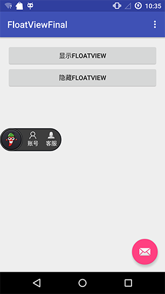

# 游戏领域:泡椒

<ol class="breadcrumb"><li><a href="/">Home</a></li><li class="active">泡椒</li></ol>

### 开源项目
|名称|网址|语言|说明|
|------|------|------|------|
|PJSDK|https://github.com/pengjianbo/PJSDK|Android|泡椒网游戏联运SDK|
|FloatViewFinal|https://github.com/pengjianbo/FloatViewFinal|Android|泡椒网游戏SDK Float View（悬浮窗）实现 (兼容MIUI系统) |
|MutiChannelPackup|https://github.com/pengjianbo/MutiChannelPackup|Java|Android多渠道打包，有网页版，Gradle版，Python版、BAT脚本、Jar版…看大家的喜好选择|

