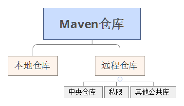

# Java:Maven

<ol class="breadcrumb"><li><a href="/">Home</a></li><li><a href="/java/overview.md">Java</a></li><li class="active">Maven</li></ol>

## 环境搭建
1. [下载](http://maven.apache.org/download.cgi) 新版maven
2. Java环境安装
3. 解压maven压缩包到指定目录，比如`d:\apps\maven`
4. 系统变量里添加变量`M2_HOME`，变量值为`d:\apps\maven`；`PATH`变量值末尾加上`;%M2_HOME%\bin`
5. 增加默认执行maven程序时的Java内存大小，系统变量里添加`MAVEN_OPTS`，变量值为`-Xms128m -Xmx512m`

## Maven坐标

|坐标|说明|
|------|------|
|groupId|定义当前maven项目隶属的实际项目；表示方式与java包名表示方式类似，通常与域名反向一一对应。比如`com.stozen.app`|
|artifactId|该元素定义实际项目中的一个maven项目(模块)，推荐做法是使用实际项目名称作为artifactId的前缀。比如`app-core`|
|version|该元素定义maven项目当前所处版本。比如`1.0.0`或`2.0.0-SNAPSHOT`|
|packaging|该元素定义maven项目的打包方式；`jar`或者`war`，默认是`jar`|
|classifier|该元素用来帮助定义构建输出的一些附属构件；`javadoc`和`sources`用的最多|

## scope依赖范围
依赖范围用来控制依赖于这三种`classpath`(`编译classpath`、`测试classpath`、`运行classpath`)的关系

|依赖范围|说明|
|------|------|
|compile|编译依赖范围。此为依赖范围默认选项。对于编译、测试、运行三种classpath都有效|
|test|测试依赖范围。只对于测试classpath有效|
|provided|已提供依赖范围。对于编译和测试项目的时候需要该依赖，但是在运行项目的时候，由于容器已经提供，就不需要maven重复的引用一遍|
|runtime|运行时依赖范围。对于测试和运行classpath有效。典型的例子是JDBC驱动实现，项目主代码的编译只需要JDK提供的JDBC接口，只有在执行测试或者运行项目的时候才需要实现上述接口的具体JDBC驱动|
|system|系统依赖范围。依赖关系和`provided`依赖范围一致，但是使用system返回的依赖时必须通过systemPath元素显式地指定依赖文件的路径。由于此类依赖不是通过maven仓库解析的，而且往往与本机系统绑定，可能造成构建的不可移植|
|import `(Maven 2.0.9及以上)`|导入依赖范围。该依赖不会对三种classpath产生实际的影响|

以下为system依赖范围的实例
```xml
<dependency>
  <groupId>javax.sql</groupId>
  <artifactId>jdbc-stdext</artifactId>
  <version>2.0</version>
  <scope>system</scope>
  <systemPath>${java.home}/lib/rt.jar</systemPath>
</dependency>
```

## Maven仓库
a) Maven仓库分类：



b) 远程仓库的配置：
```xml
<project>
  ...
  <repositories>
    <repository>
      <id>jboss</id>
      <name>JBoss Repository</name>
      <url>http://repository.jboss.com/maven2/</url>
      <releases>
        <enabled>true</enabled>
      </releases>
      <snapshots>
        <enabled>false</enabled>
      </snapshots>
      <layout>default</layout>
    </repository>
  </repositories>
</project>
```

c) 远程仓库的认证，需要在`settings.xml`里进行设置
```xml
<settings>
  ...
  <servers>
    <server>
      <id>my-proj</id>
      <username>repo-user</username>
      <password>repo-pwd</password>
    </server>
  </servers>
  ...
</settings>
```

d) 部署至远程仓库：
```xml
<project>
  ...
  <distributionManagement>
    <repository>
      <id>proj-releases</id>
      <name>Proj Release Repository</name>
      <url>http://192.168.1.100/content/repositories/proj-releases</url>
    </repository>
    <snapshotRepository>
      <id>proj-snapshots</id>
      <name>Proj Snapshot Repository</name>
      <url>http://192.168.1.100/content/repositories/proj-snapshots</url>
    </snapshotRepository>
  </distributionManagement>
</project>
```

配置完后，执行命令行`mvn clean deploy`

e) 仓库镜像，需要在`settings.xml`里进行设置
```xml
<settings>
  ...
  <mirrors>
    <mirror>
      <id>nexus-aliyun</id>
      <mirrorOf>*</mirrorOf>
      <name>Nexus aliyun</name>
      <url>http://maven.aliyun.com/nexus/content/groups/public</url>
    </mirror>
  </mirrors>
  ...
</settings>
```

f) 可用的私服软件

|名称|授权类型|
|------|------|
|[Apache Archiva](https://archiva.apache.org/)|(open source)|
|[JFrog Artifactory Open Source](https://www.jfrog.com/open-source)|(open source)|
|[JFrog Artifactory Pro](https://www.jfrog.com/artifactory/)|(commercial)|
|[Sonatype Nexus OSS](https://www.sonatype.org/nexus/go/)|(open source)|
|[Sonatype Nexus Pro](https://links.sonatype.com/products/nexus/pro/home)|(commercial)|

g) 本地仓库路径修改

1. 默认本地仓库路径为`c:\Users\xxx\.m2\repository`
2. maven配置文件路径为`%M2_HOME%\conf\settings.xml`
3. 取消53行注释状态，并修改仓库路径，比如：`<localRepository>d:\apps\m2\repository</localRepository>`
4. 执行命令复制本地包到新的仓库路径 `mvn help:system`
5. 复制配置文件到仓库路径下 `copy %M2_HOME%\conf\settings.xml d:\apps\m2\repository\`

## Maven生命周期
Maven拥有三套相互独立的生命周期，分别为`clean`、`default`和`site`

a) clean生命周期

1. pre-clean 执行一些清理前需要完成的工作
2. clean 清理上次构建生成的文件
3. post-clean 执行一些清理后需要完成的工作

b) default生命周期

* validate
* initialize
* generate-sources
* process-sources 处理项目主资源文件
* generate-resources
* process-resources
* compile 编译项目的主源码
* process-classes
* generate-test-sources
* process-test-sources 处理项目测试资源文件
* generate-test-resources
* process-test-resources
* test-compile 编译项目的测试代码
* process-test-classes
* test 使用单元测试框架运行测试
* prepare-package
* package 接收编译好的代码，打包成可发布的格式，如JAR
* pre-integration-test
* post-integration-test
* verify
* install 将包安装到maven本地仓库
* deploy 将最终的包复制到远程仓库

c) site生命周期

* pre-site 执行一些在生成项目站点之前需要完成的工作
* site 生成项目站点文档
* post-site 执行一些在生成项目站点之后需要完成的工作
* site-deploy 将生成的项目站点发布到服务器上

d) 命令行与生命周期

|命令行|说明|
|------|------|
|$mvn clean|调用clean生命周期的pre-clean和clean阶段|
|$mvn test|调用default生命周期的validate到test的所有阶段|
|$mvn clean install|调用clean生命周期的pre-clean和clean阶段，以及default生命周期的validate到install的所有阶段|
|$mvn clean deploy site-deploy|调用clean生命周期的pre-clean和clean阶段，以及default生命周期的所有阶段，还有site生命周期的所有阶段|

e) 插件与生命周期

比如**往Jar包里添加默认启动类**
一般生成Jar包后，执行`java -jar xxx.jar`后会返回如下信息
```
xxx.jar中没有主清单属性
```
我们解压Jar包，并在包里查看`META-INFO\MANIFEST.MF`，没有发现入口类`Main-Class: xxx`
所以需要在`pom.xml`文件里添加`maven-shade-plugin`插件，并将其内容绑定到default生命周期的`package`阶段上
```xml
<build>
  ...
  <plugins>
      <plugin>
        <groupId>org.apache.maven.plugins</groupId>
        <artifactId>maven-shade-plugin</artifactId>
        <version>1.2.1</version>
        <executions>
          <execution>
            <phase>package</phase>
            <goals>
              <goal>shade</goal>
            </goals>
            <configuration>
              <transformers>
              <transformer implementation="org.apache.maven.plugins.shade.resource.ManifestResourceTransformer">
                  <mainClass>com.stozen.app.HelloWorld</mainClass>
              </transformer>
              </transformers>
            </configuration>
          </execution>
        </executions>
      </plugin>
  </plugins>
  ...
</build>
```
这样在`META-INFO\MANIFEST.MF`里可以看到`Main-Class: com.stozen.app.HelloWorld`这行

