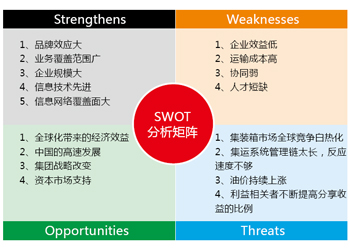
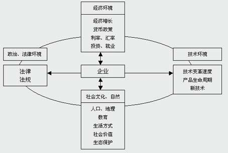

# 行政人事管理:战略名词 <small>Strategy Keywords</small>

<ol class="breadcrumb"><li><a href="/">Home</a></li><li class="active">Strategy Keywords</li></ol>

### 战略名词
|英文名|中文名|说明|
|------|------|------|
|SWOT (strengths, weaknesses, opportunities, threats)|SWOT分析法|所谓SWOT分析，即基于内外部竞争环境和竞争条件下的态势分析，就是将与研究对象密切相关的各种主要内部优势、劣势和外部的机会和威胁等，通过调查列举出来，并依照矩阵形式排列，然后用系统分析的思想，把各种因素相互匹配起来加以分析，从中得出一系列相应的结论，而结论通常带有一定的决策性 |
|PEST (politics, economy, society, technology)|PEST分析法|PEST分析是指宏观环境的分析，P是政治(politics)，E是经济(economy)，S是社会(society)，T是技术(technology)。在分析一个企业集团所处的背景的时候，通常是通过这四个因素来进行分析企业集团所面临的状况 |
