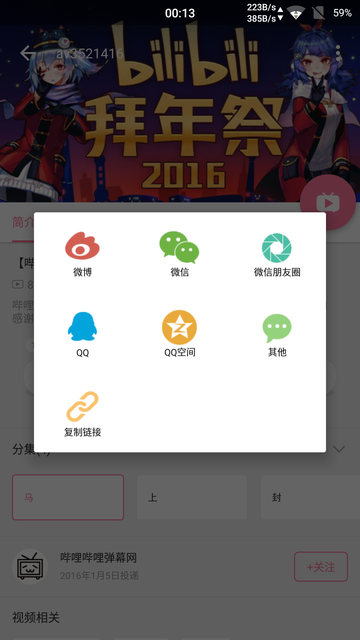
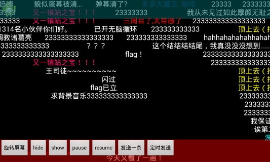

# 视频领域:Bilibili

<ol class="breadcrumb"><li><a href="/">Home</a></li><li class="active">Bilibili</li></ol>

### 开源项目
|名称|网址|语言|说明|
|------|------|------|------|
|BiliShare|https://github.com/Bilibili/BiliShare|Android|Bilibili开源的分享文字、图片、网页、视频、音频到QQ、QQ空间、微信、微信朋友圈、微博等平台的安卓SDK |
|DanmakuFlameMaster|https://github.com/Bilibili/DanmakuFlameMaster|Android|android上开源弹幕解析绘制引擎项目 |
|apk-channelization|https://github.com/Bilibili/apk-channelization|Python|Android多渠道输出脚本，通过直接修改二进制AndroidManifest.xml实现渠道替换|
|flv.js|https://github.com/Bilibili/flv.js|Javascript|一个实现了在 HTML5 视频中播放 FLV 格式视频的 JavaScript 库。它的工作原理是将 FLV 文件流转码复用成 ISO BMFF（MP4 碎片）片段，然后通过 Media Source Extensions 将 MP4 片段喂进浏览器|
|ijkplayer|https://github.com/Bilibili/ijkplayer|Android & iOS|ijkplayer 是一款做视频直播的框架, 基于ffmpeg, 支持 Android 和 iOS|

