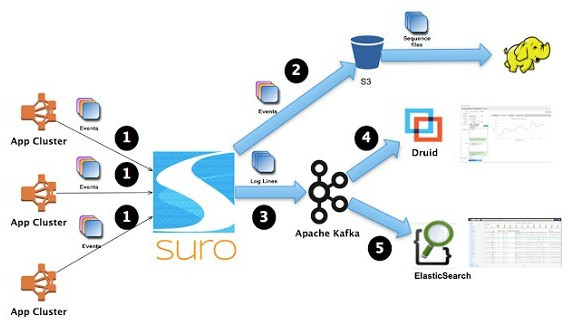
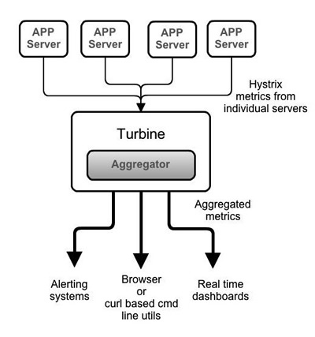
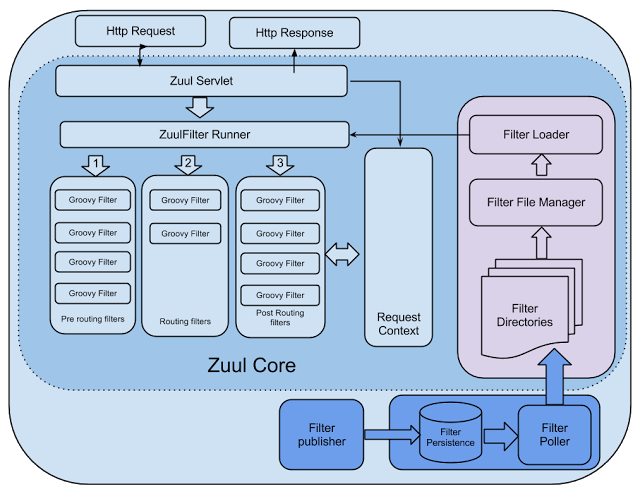
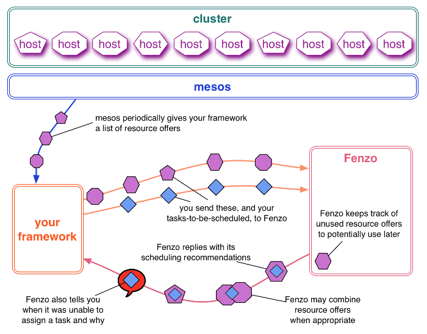
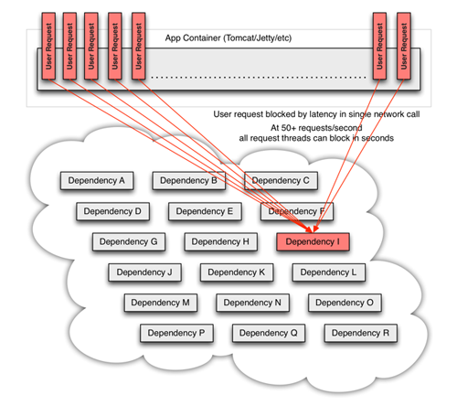

# 视频领域:Netflix

<ol class="breadcrumb"><li><a href="/">Home</a></li><li class="active">Netflix</li></ol>

### 开源项目
|名称|网址|语言|说明|
|------|------|------|------|
|Curator|http://curator.apache.org/|Java|Curator是Netflix开源的一套ZooKeeper客户端框架. Netflix在使用ZooKeeper的过程中发现ZooKeeper自带的客户端太底层, 应用方在使用的时候需要自己处理很多事情, 于是在它的基础上包装了一下, 提供了一套更好用的客户端框架|
|Suro|https://github.com/Netflix/suro|Java|Netflix开源了一个叫做Suro的工具，它能够在数据被发送到不同的数据平台（如Hadoop、Elasticsearch）之前，收集不同应用服务器上的事件数据，这项创新技术具备成为大数据主流实践的潜力 |
|Turbine|https://github.com/Netflix/Turbine|Java|在复杂的分布式系统中，相同服务的结点经常需要部署上百甚至上千个，很多时候，运维人员希望能够把相同服务的节点状态以一个整体集群的形式展现出来，这样可以更好的把握整个系统的状态。 为此，Netflix又提供了一个开源项目（Turbine）来提供把多个hystrix.stream的内容聚合为一个数据源供Dashboard展示 |
|Astyanax|https://github.com/Netflix/astyanax|Java|Astyanax是一个高级的Apache Cassandra的Java客户端。Apache Cassandra是一个高可用性的面向列数据库。它的特性：    高级别，简单的面向对象的Cassandra接口。在客户端实现故障转移抽象的连接池|
|Servo|https://github.com/Netflix/servo|Java|Netflix Servo 用Java语言，提供暴露、发布应用运行指标的简单接口，主要满足的需求包括：使用JMX、简单、灵活发布|
|zuul|https://github.com/Netflix/zuul|Java|Zuul 是在云平台上提供动态路由，监控，弹性，安全等边缘服务的框架。Zuul 相当于是设备和 Netflix 流应用的 Web 网站后端所有请求的前门。Zuul 可以适当的对多个 Amazon Auto Scaling Groups 进行路由请求 |
|Fenzo|https://github.com/Netflix/Fenzo|Java|Fenzo是一个在Mesos框架上应用的通用任务调度器。它可以让你通过实现各种优化策略的插件，来优化任务调度，同时这也有利于集群的自动缩放 |
|Rend|https://github.com/Netflix/rend|Go|Netflix 出品的与 memcached 协议兼容的高并发代理服务器|
|Falcor|https://github.com/Netflix/falcor|Javascript|Netflix利用Falcor库实现通过JSON数据填充他们网页应用的用户界面。所有来自内存缓存或者多个数据库的后端数据，都通过一个虚拟JSON对象进行建模。这个JSON对象被称为“虚拟”，是因为从客户端的视角来看，这些数据来自内存，而事实上这些数据可能来自本地或者远程数据库|
|Hystrix|https://github.com/Netflix/Hystrix|Java|Netflix近日发布了Hystrix，该库旨在通过控制那些访问远程系统、服务和第三方库的节点，从而对延迟和故障提供更强大的容错能力。Hystrix具备拥有回退机制和断路器功能的线程和信号隔离，请求缓存和请求打包，以及监控和配置等功能 |

