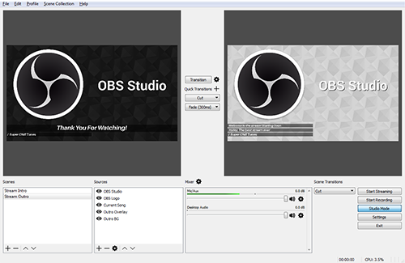

# 视频领域:OBS

<ol class="breadcrumb"><li><a href="/">Home</a></li><li class="active">OBS</li></ol>

### 开源项目
|名称|网址|语言|说明|
|------|------|------|------|
|Open Broadcaster Software|https://obsproject.com|C|OBS(Open Broadcaster Software)是一个广泛使用的视频录制直播软件。利用该软件可以实现桌面窗口、游戏、网页、RTMP流、图像等的录制直播。OBS也是一个开放源代码的软件，因此我们可以在源代码的基础上进行修改，来实现我们自己的定制功能。OBS Studio是当前正在维护的版本，老版本叫做OBS Classic。相对老版本而言，OBS Studio在架构上进行了重构，采用微内核+插件的形式进行开发。作者意图通过这种架构来独立出核心代码，将周边功能作为插件形式实现。这在一定程度上提高了项目的可维护性，也让新功能的扩展变得更加简单。OBS Studio本身内置了一些常用的插件，如窗口捕获、视频捕获设备、文本、图像、媒体源等 |

