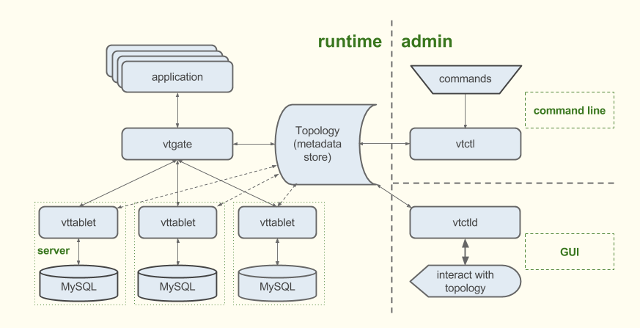

#  视频领域:Youtube

<ol class="breadcrumb"><li><a href="/">Home</a></li><li class="active">Youtube</li></ol>

### 开源项目
|名称|网址|语言|说明|
|------|------|------|------|
|Doorman|https://github.com/youtube/doorman|Go & Python|Doorman 是全球分布式客户端速率限制解决方案，客户端跟一个共享资源(比如一个数据库，gRPC 服务，RESTful API 或者其他)的通讯可以使用 Doorman 自动限制他们对资源库的使用(每秒的请求数)。Doorman 的一些高可用特性需要依赖分布式锁管理器。Doorman 当前支持 etcd，但相对简单的需求可以使用 Zookeeper 代替|
|Vitess|http://vitess.io/|Go|Youtube出品的开源分布式MySQL工具集Vitess，自动分片存储MySQL数据表，将单个SQL查询改写为分布式发送到多个MySQL Server上，支持行缓存（比MySQL本身缓存效率高），支持复制容错，已用于Youtube生产环境 |

